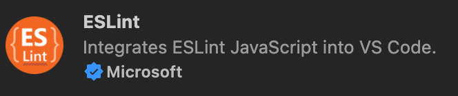
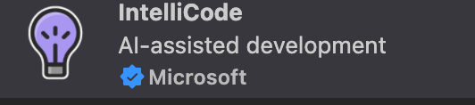
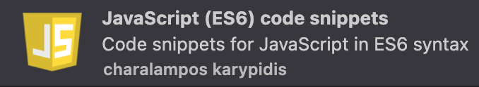
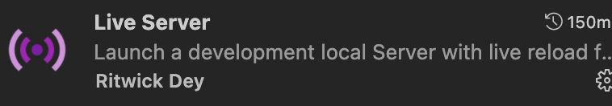
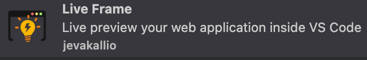
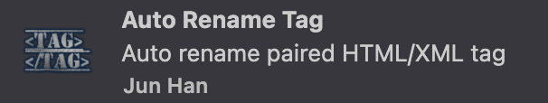
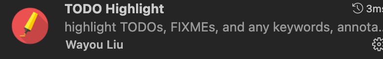
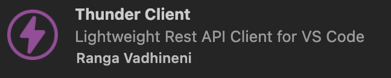
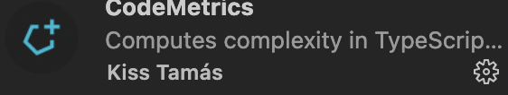

### eslint插件

该插件可以读取项目中的eslint配置文件，在你编写代码时，提供代码语法检查，并给出错误提醒。
⚠️插件本身不会提供代码语法检查功能，你必须确保用npm安装好eslint。

### prettier插件

该插件可以读取项目中的prettier配置文件，在你编写代码时，发现不合适的格式问题，并格式化处理，让团队中每个人的代码风格更统一。
⚠️你需要用npm安装好prettier，否则插件本身不具备什么功能。

### intelliCode插件

该插件提供 Python Java Typescript Javascript代码智能提示。

### javascript code snippets 插件

该插件提供javascript、typescript的代码片段简记插入，你只需要打印几个字符，就可以直接得到字符对应的代码片段。

### live sass compiler插件

该插件可以直接编译sass scss文件为css文件，使用该插件时，你不需要用npm安装sass

### live server插件

该插件可以开启一个本地服务器用来打开一个html页面。

### live frame 插件

直接在vscode中预览web程序的界面，无需在vscode和浏览器中来回交换，同时浏览器上的热重载功能，预览也支持。

### open in browser插件

该插件可以将一个html文件用指定的浏览器打开。

### auto rename tag插件

该插件可以让你修改html成对标签的一方时，另一方也自动修改。比如有`

`，当你把`
`修改为``时，`
`自动修改为``。

### todo highlight插件

对注释中的 `TODO`  `FIXME` 等字段给出高亮提示，更多字段和颜色可以自定义。

### vetur 插件

vue2.0下的插件。
* vue语法提示
* vue格式化
* vue snippets 
等等功能。

### volar 插件

vue3.0下的插件。
* 支持 vetur 的功能；
* 对 ts 支持非常好；
* 包含其他非常有用的功能；
> volar 和 vetur 只能二选一使用
  

### thunder client 插件

功能等同于 postman，功能完整，比较轻量

### code metrics

计算 javascript 或者 typescript 代码片段的复杂度，适用于 code review 阶段。