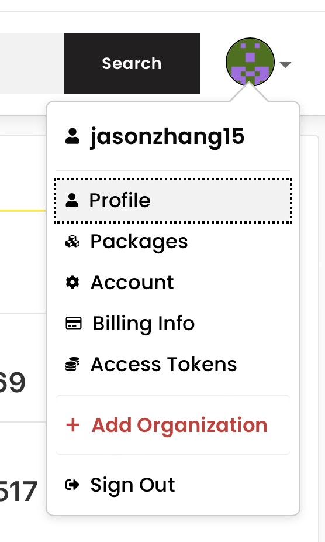

[toc]

# 先注册账户
最最最开始的步骤。

登录 [npm官网](https://www.npmjs.com) 注册个人账户

注册之后，你会拥有一个账户名， 下图展示的就是我的账户名 `jasonzhang15`：

请记住这个用户名！！！！

# 发布scope为个人账户名的public package
## package name 要正确
给这种package命名的时候，如果package.json中的name取名为`@jasonzhang/hello`， 是错误的。从格式上看，名字符合npm官网scope package name的规则。但是，请注意 `@`后边一定是一个合法的npm账户名！

我的账户名是 `jasonzhang15`， 因此这个package应该叫做`@jasonzhang15/hello`。

如果你不这么做，在发布包的时候，npm会说找不到合法账户`jasonzhang`，拒绝发布。

## package registry要正确
你publish的包，是要传到一个package registry。

如果你要传到npm官方registry，那么你就要把 registry 设置为人家的地址；

如果你要传到第三方registry, 那么你就要把 registry 设置为第三方的地址。

查看当前的registry： `npm config get registry`

设置新的registry, 比如npm官方registry: `npm config set registry "https://registry.npmjs.org/"`

不过，要发布到多个 registry 上，每次都要执行 `npm config set` 去切换，不太方便，而且registry的地址记起来太麻烦，
建议使用工具`nrm`帮忙，安装方法: `npm install -g nrm`

## package中的哪些文件会被上传
package.json中的 `files` 指定了哪些文件，就会上传哪些文件

验证方式：`npm publish --dry-run`
> 该命令的输出结果，会告诉你哪些文件会被上传

## 发布用到的命令
进入包目录下。

在npm官网虽然注册了账户，但是本地却不知道账户信息，所以你要在本地注册一下账户信息，之后再发送publish请求的时候，这个信息才会带到npm官网，npm才能进行身份验证操作。你只需执行：
`npm adduser`

接下来，你就可以publish了：`npm publish --access public`

# 使用lerna发布
lerna发布的话，会拿着所有非私有package问你，让你确认它们的版本号。

如果你只想发布一个package，就别用lerna发布了。

`lerna.json`的`version`：
- 如果是一个确切的版本号，如`0.0.0`，那么所有package的包被lerna发布时，采用同一个版本号；
- 如果是`independent`，那么lerna发布的时候，会依次问你每个package的版本号应该是多少；

# package.json 
[前往](../packageJson总结.md)