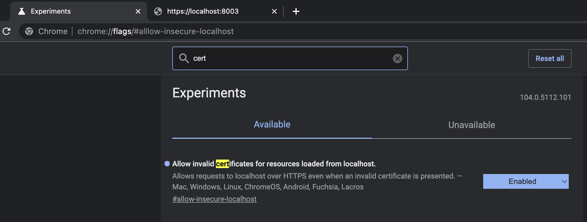

### 项目搭建过程
`yarn init`
`yarn add koa`
`yarn add eslint -D`
`yarn add prettier -D`
`yarn add typescript ts-node`

`yarn add @types/node -D `
`yarn add @types/koa -D`
> 因为要使用ts写代码，要补充ts声明文件；

`npx eslint --init`
> 跟着终端提示走，创建eslint的基础配置文件；
> 此处我选择生成 .eslintrc.json文件；
> 如不满足，按照eslint官网内容，补充配置；
> 由于我选中使用@typescript-eslint/recommended插件，无法在ts中使用require引入模块；

`yarn add eslint-config-prettier -D  `
> 这个插件解决eslint和prettier的规则冲突，优先选择prettier的规则；
> 请在.eslintrc.json 文件的 extends 中末尾加入 "plugin:prettier/recommended"，令插件生效;

`yarn add eslint-plugin-prettier prettier-eslint -D`
> eslint-plugin-prettier 令 eslint选择prettier的规则进行代码风格格式化；
> prettier-eslint插件帮助你按照prettier格式化代码，引发eslint的错误时，调用eslint --fix修复；

*注意*
eslint负责js/ts语法、风格检测和格式化， prettier负责许多代码风格检测和格式化；prettier照顾的代码类型比较广泛，因此在代码风格的检测上，使用prettier而不是eslint。

`新建 .prettierrc.json文件，写入配置`
此时，vscode依旧无法检测到非法的格式，你还需要在vscode settings.json 中加入:  
```json
"editor.codeActionsOnSave": {
    "source.fixAll.eslint": true // 每次保存的时候将代码按eslint格式进行修复
  }
```
**同时确保你的项目文件夹作为vscode的一个workspace！🎉**


`yarn add husky lint-staged -D`
> husky 用于注册 git hook，也就是当执行git某些操作的之后，执行一些指令；
> lint-staged 设置对 git 暂存区文件的操作；

在package.json 文件中加入 
```json
{
    ...
    "scripts": {
        "prepare": "husky install",
        ...
    },
    ...
    "husky": {
        "hooks": {
            "pre-commit": "lint-staged"
        }
    },
    "lint-staged": {
        "./**/*.ts": ["prettier --write", "eslint --cache --fix", "git add"]
    }
}
```
> eslint 的 --cache 表示只对做出修改的文件进行 lint 检测；
> husky install 用来在 .git/hooks/ 下生成 hook 脚本；


以上操作之后，项目就搭建起来了；
如果别人想上手的话，只需要下载项目后，切入到项目根路径，执行 `yarn` 即可。


### 开启google浏览器证书验证
google浏览器输入 chrome://flags/#alllow-insecure-localhost
如图开启选项：


重启 google 浏览器

输入 https://localhost:8003/

即可观察到效果