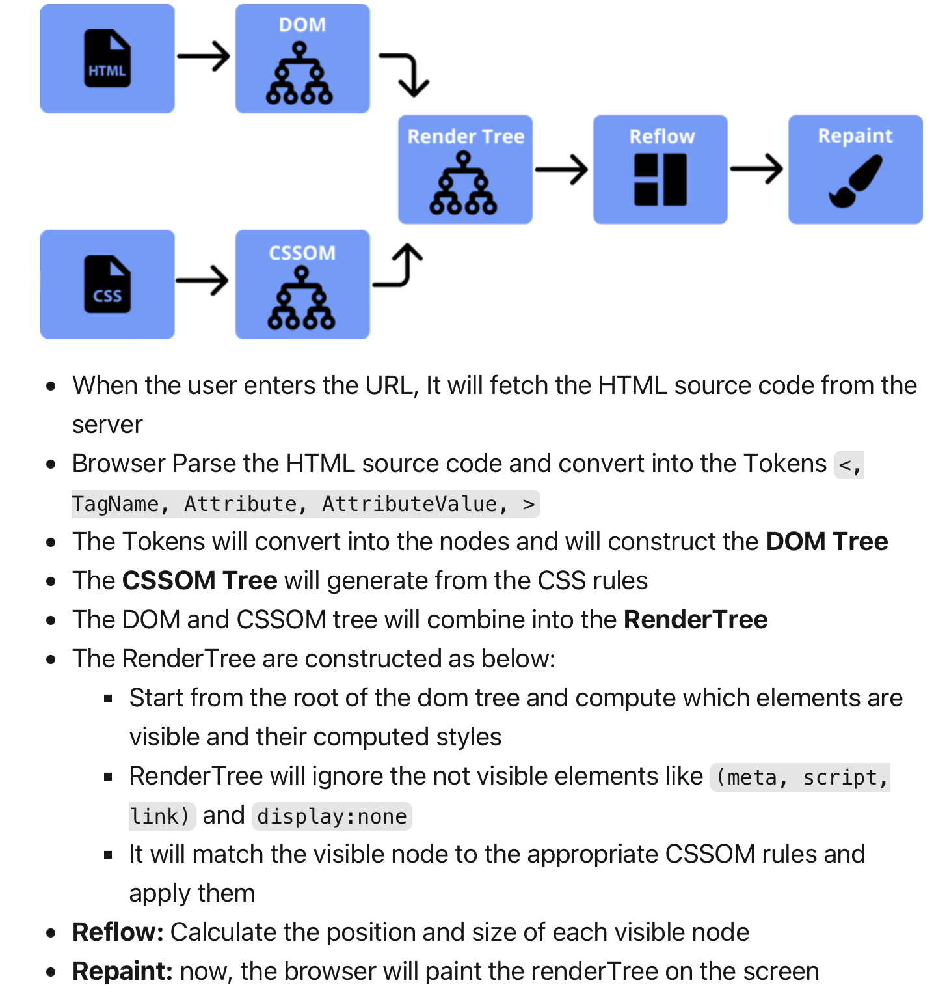
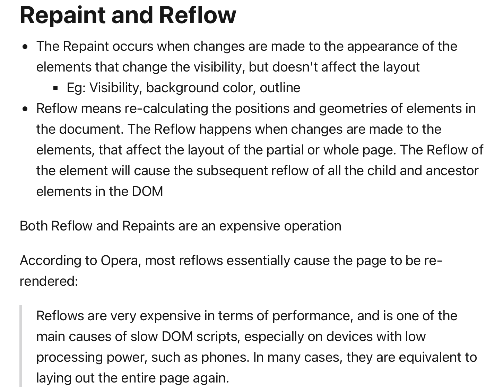

[toc]

### css3新特性
* CSS3选择器
* CSS3边框(Borders)
* CSS3背景
* CSS3渐变
* CSS3文本效果
* CSS3字体(@font-face规则)
* CSS3转换和变形
  * 2D转换方法
  * 3D转换属性
* CSS3过渡（transition属性）
* CSS3动画（@keyframes规则 animation属性）
* CSS3多列
* CSS3盒模型
* CSS3伸缩布局盒模型(弹性盒子)（flexbox）
* CSS3多媒体查询（@media）

<br>

### css样式有哪些，优先级是多少？
* 行内样式  
    ```html
    <div style="color: red">
    ```
* 内链样式
    ```html
    <style>
    body {
        color: red
    } 
    </style>
    ```
* 外链样式
    ```html
    <link rel="stylesheet" href="./base.css" />
    ```

**优先级**  
`! important` > `行内样式` > `id选择器` > `类选择器` > `标签选择器` > `通配符` > `继承  `
> 继承的优先级是0


**优先级权重**
* `!important` 权重 10000
* `行内样式` 权重 1000  
* `ID选择器` 权重 100   
* `类选择器` `伪类选择器` `属性选择器` 权重 10  
* `标签选择器` `伪元素选择器` 权重 1
* `通用选择器*` `子选择器>` `相邻选择器+` `同胞选择器 ~` 权重 0 

<br>

### animation 和 transition 的区别
* animation需要配合 @keyframes使用；
* animation可以触发多次，transition触发一次；
* animation可以设置多个桢， transition只能设置两个；
* 前者可能会引发多次重回流，后者比较少；


<br>


### 什么是回流？什么是重绘？
* 回流：当 render tree 中的元素发生尺寸、布局、隐藏等改变而重新构建，就是回流；
> 比如修改 width， height， display等

* 重绘：当 render tree 中的元素更新属性，这些属性只影响元素的外观、风格，不影响布局的，就是重绘；
> 比如修改 color， background-color等

<br>

### 如何对回流和重绘做优化？
[blog](https://dev.to/gopal1996/understanding-reflow-and-repaint-in-the-browser-1jbg)





<br>

### 什么是全局属性？
全局属性就是所有的标签都可以使用的属性，比如 class id style等。

<br>

### css中哪些属性可继承？
文本类的：text开头的属性, `text-decoration`  `text-transform`   

字体类的：font开头的属性, `font-size` `font-family` `font-weight`  `font-variant`  

文本间距类的属性：`white-space` `letter-spacing` `word-spacing`    
 
文本颜色： `color`    

列表类的： list 开头的属性, `list-style` `list-style-type` `list-style-position`  `list-style-image`    

行高： `line-height`

其他：  `visibility`  `cursor`

<br>

### 字体、css文件、js文件是否引发跨域问题？
* css文件加载，不会引发跨域问题；
* 字体、图片可能会引发跨域问题；
* canvas中使用drawImage贴图会引发跨域问题；
> 在 img 中加入 crossOrigin=' ';  
> 在服务端的响应头中加入Access-Control-Allow-Origin: *;   
> 就可以解决该跨域问题。
* window.onerror默认情况下无法获得跨域脚本的错误；
> 解决js文件跨域问题的方法：  
> 在script中加入 crossOrigin=' ';  
> 在服务端的响应头中加入Access-Control-Allow-Origin: *;
> 这样处理的话，就可以在window.onerror中捕捉到跨域脚本的错误；


<br>

### 如何使得\<p>中的内容可以编辑？
```html
<p contenteditable="true">这一行是可以编辑的</p>
```

<br>


### 如何阻止事件传播？
W3C：
* `event.preventDefault()` 阻止事件的默认行为
  
* `event.stopPropagation()` 阻止事件向上冒泡传递
  
* `event.stopImmediatePropagation()` 如果同一个html element的一个事件上，设置了多个事件响应函数，那么调用该方法的事件响应函数可以继续执行下去，排在其后边的事件响应函数不会执行。除此之外，还会阻止事件向上冒泡传递

IE：
* `event.cancelBubble()` 阻止事件冒泡
* `event.returnValue()`  取消事件的默认行为

<br>

 ### `display: none` 和 `visibility: hidden` 的区别
 * `display:none`的元素，仍然存在于html中，但是在屏幕上没有显示，他的消失，会影响到DOM布局；
 * `visibility: hidden`的元素，仍然存在于html中，但是屏幕上没有显示，却还占据着空间，不会影响到DOM布局；

<br>

### 辨析 calc attr currentcolor
* calc
  * 支持 `+` `-` `*` `/` 运算；
  > `+` `-` 运算时，注意符号两侧留有空格， `*` `/` 可以不留
  * 支持 px em rem % 等单位；
* attr
  * 适用于所有的css属性；
  * 用在content之外的属性，是实验阶段的；
  * 使用的时候必需要注意到浏览器的兼容支持程度；
* currentcolor
  * 表示当前element的color值；
  * `color: currentcolor`等效于 `color: inherit`;
  * currentcolor也可以写成currentColor;

<br>

### 新多媒体元素有哪些？
* \<audio> 音频
* \<video> 视频
* \<source> 视频或音频的多个来源选择
* \<embed> 支持其他的一些媒体格式，比如pdf，需要浏览器及其插件的支持
* \<track>  字幕

<br>

### 优化CSS 图片加载的技术有哪些？
* CSS Sprite
  > 又称为CSS精灵或者雪碧图，是一种网页图片应用处理方式。  
  > 它允许你将一个页面涉及到的所有零星图片都包含到一张大图中去，当访问该页面时，载入的图片就不会像以前那样一幅一幅地慢慢显示出来了。  
  > 能很好地减少网页的http请求，从而大大的提高页面的性能。

* SVG Sprite
  > 与CSS Sprite类似。  
  > 另外一种实现思路 `<symbol> + <use>`。  
  > `<symbol>`用于定义可复用的形状，定义的现状不会展示出来，而是通过use元素引用来显示。

* Icon font
  > 图标字体，也叫字体图标，就是字体做的图标。能自由变化大小，且不会模糊。比图片小，加载快。可以任意改变颜色。

* Base64
  > 可以将一副图片数据编码成一串字符串，使用该字符串代替图像地址。  
  > 图片的下载始终都要向服务器发出请求，而通过base64编码后可以随着 HTML的下载同时下载到本地，减少 http 请求。

<br>


### marginTop 和 marginBottom 的叠加条件
* 两个元素相邻，且位于垂直方向上比邻
* 上元素的marginBottom 和 下元素的marginTop之间没有被分割；
  > 没有被其他html元素隔开；  
  > 没有被 padding border隔开；
* 两个元素位于同一个BFC中，且这两个元素本身不是BFC。


### css隔离的几种方案
- scoped css 
- css module 
- styled component
- shadow dom 

[scoped css and css module](../公司/好未来.md#了解过css-module么)

[use styled component in react app](https://www.bilibili.com/video/BV18a411C74j?p=5&vd_source=8e22a21e39978743c185c338fa9b6d6d)