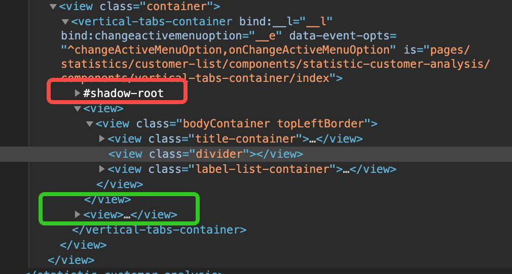

[toc]

## 技术参考文档
[uni-app开发经验总结 juejin](https://juejin.cn/post/7255855818595647546)

## 微信小程序的架构

## uni-app

### uni-app主包页面挂载问题
1. 第一次进入主包页面会触发 mounted
2. 挂载后，从主包页面跳转到分页，再跳转回来，不会触发 mounted， 会触发 onPageShow
3. 从主包页面切换到另一个主包页面，再切换回来，不会触发 mounted，会触发 onPageShow
4. 调用 uni.switchTab, 页面栈帧中，tab页不会被销毁，非tab页全部被销毁
5. 调用 uni.reLaunch, 页面栈帧所有页面都被销毁，新页面入栈
6. 调用 uni.navigateTo, 新页面直接入栈
7. 调用 uni.navigateBack, 当前页面出栈
8. 调用 uni.redirectTo, 当前页面出栈，新页面入栈

### uni-app小程序页面生命周期函数和vue组件生命周期函数执行顺序？
假设父组件是一个页面级组件，拥有一个子组件，则执行顺序如下：
```bash
# 挂载时
父组件beforeCreate
父组件created
父组件beforeMount
子组件beforeCreate
子组件created
子组件beforeMount
父组件onLoad
父组件onShow
子组件mounted
父组件mounted
父组件onReady


# 卸载时
父组件onUnload
子组件beforeDestroy
子组件destroyed
父组件beforeDestroy
父组件destroyed
```

### $attrs 透传无效
uni-app小程序不支持 `v-bind="$attrs"` 的透传方式

### uni-app小程序中子组件的Prop属性值变化无法 watch 到？
有诸多原因：
1. prop属性没有赋初始值；
2. 父组件绑定到子组件prop属性上的变量，不是响应式；
3. 子组件prop属性名起的不好，比如 'id';
4. 子组件watch的时候，没有加入 `immediate: true` 或 `deep: true`；
5. 子组件watch的时候，prop的值，和对应的组件state值一样，没有引发state的变化，进而不会触发 state相关的UI视图更新；
6. 没有使用 Vue.nextTick().then 回调，根据子组件的最新prop属性值，更新关联的变量；

### bind prop 在小程序中不起作用？
```html
<child :color="data.length > 3"></child>

data 发生变化的时候，child没有重新渲染 color

解决方式：
1. child 内部watch color 属性，使用 data 变量控制内部逻辑, 注意要在 Vue.nextTick 中赋值；
 {
   watch: {
    color(value) {
      Vue.nextTick().then(() => this.innerColor = value)
    }
   }
 }
2. 父组件中，不要使用 `data.length > 3`的表达式，使用 computed属性，如
{
  get showColor() {
    return this.data.length > 3
  }
}
```

### 小程序设置组件的 class 和 style
```html
Hello 组件定义：
<template>
  <view class="hello">
  </view>
</template>

Hello 组件应用:
<Hello :style="{color: 'red'}" class="container" />

小程序渲染之后：
<Hello style="color: 'red'" class="container">
 shallow:
   <view class="hello"></view>
</Hello>

shallow 是 Web 的 shallow component 挂载标志词，它里面的组件样式独立，也就是说：
1. Hello组件所在作用域内的css style global 无法覆盖 <view class="hello" ></view> 及其子节点的样式；
2. <view class="hello"></view>的相对取值，参考的是 <Hello style="color: red" class="container"></Hello>;
3. 根据第2点，可以通过设置 Hello 组件的样式影响组件内部，比如说
.hello { width: 50%; }, 我们就可以在 .container 中设置 width 的值来控制 .hello 的宽度；

--------

补充：

单根节点组件：
<template>
  <view class="a"></view>
</template>

多根节点组件：
<template>
  <view class="a"></view>
  <view class="b"></view>
</template>

按照 vue 官方的说法，对于单根节点组件，组件上的class会和单根节点合并，也就是说：
Hello:
<template>
  <view class="a"></view>
</template>

<Hello class="b"></Hello>
等效于
<Hello>
  shallow:
  <view class="a b"></view>
</Hello>

```

### u-tabs被切换组件的挂载问题
1. 切换时，采用 `v-if` 的话，组件会重新 mounted
2. 切换时，采用 `v-show` 的话，所有组件都会先 mounted，可以给子组件绑定一个prop, 监听它是否被展示，进而完成一些数据加载、更新的操作，当切换到另一个组件时，之前的组件的数据不会被销毁，组件状态就会缓存起来，回头儿再切回去的时候，该高亮的选项、该选中的下拉框都会和以前一样，不会重置；


### u-tabs 各个参数
```tsx
<u-tabs
    :list="headerTabList"
    :is-scroll="false"
    :current="currentHeaderTab"
    :height="64"
    :font-size="32"
    :bar-width="50"
    :bar-height="6"
    active-color="#134AED"
    inactive-color="#666666"
    :active-item-style="{ color: '#222222' }"
    :bar-style="{ borderRadius: '4px', bottom: '-3px' }"
    @change="changeTab"
/>
```
* height: 单位 rpx, tab文字的高度（下划滑块默认absolute定位在文字底部）
* font-sie: 单位 rpx, tab文字的font-size
* bar-width: 单位 rpx， tab下划滑块的宽度
* bar-height: 单位 rpx, tab下划滑块的高度
* active-color: 下划滑块的颜色
* inactive-color: 未选中时，tab文字默认颜色
* active-item-style: 设置选中时， tab 文字的样式；
* bar-style: 设置 下划滑块 的样式

> 注意： 在不同机型渲染的结果不同，在IOS上可能会出现底部凸出小白块的问题，此时可以调整height值解决


### scroll-view 为什么设置不了 padding-right ?
在 y 轴方向可滚动的 scroll-view, 设置这些值是有效的：
* padding-left
* margin-left
* margin-top
* margin-bottom
* padding-top
* padding-bottom

但是 margin-right padding-right 是无效的；

没错，scroll-view就是这个样子，只能变通解决下：
```html
<scroll-view :scroll-y="true">
  <view class="container">
    <!-- 你的组件或内容放在这里 -->
  </view>
</scroll-view>

.container {
  padding: 0 10px;
}

or

.container {
  margin: 0 10px;
}
```


### 为什么scroll-view滑至中部，触发了下拉操作？
预期： scroll-view 滑动到顶部或者底部，给一个下拉，触发下拉更新；
实际： scroll-view 滚动到中部，给一个下滑操作，结果触发下拉更新；

解决：
1. 如果 scroll-view 的高度设置了 100%, 检查其父元素是否拥有确定高度；

### 给 scroll-view 设置 flex 不生效？
必须还要设置 enable-flex 才行

### 带有 overflow: auto 的view在 IOS 出现回弹，怎么解决？
所谓回弹，就是滚动到底之后，IOS端可以继续向下滚动，从而将容器
view 的 background 颜色露出，在安卓端无此问题。

解决方式，使用 `scroll-view` 替代 `view`， 借助scroll-view 的
`enhanced='true'`, `bounces='false'` 即可完成

### 关于 :style
```html
<view :style="[objectStyle]" />
objectStyle = { color: 'white', fontSize: '12px' }

or

<view :style="stringStyle" />
stringStyle = "background: red; font-size: 12px"

or

<view :style="[compute(option)]" />
export default class extends Vue {
  get compute() {
    return (option) => {
      ...
      return { color: 'red', fontSize: '12px'}
    }
  }
}
```

在 web 上使用限制少很多
```html
<div :style="{ color: 'red', fontSize: size }" />
export default class extends Vue {
  size = '10px'
}

or

<div :style="objStyle" />
export default class extends Vue {
  objStyle = { color: 'red', fontSize: '10px' }
}

or 

<div :style="[objStyle1, objStyle2]" />
export default class extends Vue {
  objStyle1 = { color: 'red', fontSize: '10px' }
  objStyle2 = { color: 'red', fontSize: '10px' }
}

or

<div :style="compute(option)" />
export default class extends Vue {
  compute(option) {
    ...
    return { color: 'red' } || [{ color: 'red' }]
  }
}
```

### u-navBar的 custom-back函数内，this为undefined
组件内部BUG，请使用组件外的变量存储 this, 之后在 custom-back 中使用；


### 小程序中的 slot 为啥看不到？
自定义一个带有slot的组件后，如果你使用`<template #default></template>`传入slot的具体内容，很可能看不到；
因为它不会挂载到slot被定义的地方，而是直接挂在到组件标签下，具体如图：


组件的内部实现位于 shadow-root 中，而 template 被插入到 绿色框所示的位置；因此 template中的实现，其定位要参考 container，而不是 slot被定义的位置；

当 container是relative定位，将template内的view改为 absolute 定位，就能看到被插入到 slot 的内容了。

### mixin 用法导致的屏蔽问题
A extends mixin(B)
mixin用法，会将另一个vue组件B的方法、变量注入到当前组件A中，导致A没有声明的方法隐式执行；
对于同样的方法签名，先执行 B 的、后执行 A 的；

### 为什么返回到详情页会发生重复？

情形： 从列表页来到A的详情页，再从A来到B的详情页，再从B来到页面C。从C后退到B，展示正常；继续后退，页面依旧展示B，预期是展示A。
> 来自于前公司房产小程序开发经历

原因： 并不是没有展示A页面，而是回退到A页面没有在onShow的生命函数中拉取A的数据。小程序在执行 uni.navigateTo时，保留的是页面
url, 并不会保存页面的vue数据，而且不会执行 unLoad 周期函数，回退的时候会执行onShow函数，必须在此重新请求数据，方能恢复页面。
从导入客户资料页回退的时候，触发了 refreshDetail事件，而直接点击回退按键的时候，并没有触发该事件，所以前者成功回退，后者回退
失效，在A页面展示的仍然是B的数据。

### 为什么会前往认购列表页两次？
在管理端统计页，点击 认购 卡片，会切换到认购列表页，之后突然又进入认购列表页一次。
> 来自于前公司房产小程序开发经历

问题可能在于被点击的认购卡片，触发了两次点击事件，比如：
```html
<view class="outer" @click="onNav">
  <view class="component"></view>
  <view class="footer">
    
  </view>
</view>

由于事件冒泡机制，选中了img，onNav会触发一次，之后事件冒泡，outer又触发了一次

正确做法：
<view class="outer" @click="onNav">
  <view class="component"></view>
  <view class="footer">
    
  </view>
</view>
```

### 在生命周期函数外给vue变量赋值，不生效？
是生效的，请点击小程序的编译再搞一下，热重载并不总是正常的

### 文字居中对齐？
水平方向居中，没有什么问题；
垂直方向居中, 非常有问题。

1. 采用 align-items: center方法，在web端居中效果perfect，但是在 ios 和
安卓端，都无法达到完美效果，安卓端的误差更大；
2. 使用 line-height 居中策略时，即便 line-height === font-size，依旧无法保证居中，原因是有文字排版的top line、base line、bottom line存在，并不能保证上下对称，对于数字和英文字母，非常明显。而对于汉字来说，可以认为汉字上边沿到content区域顶部的距离等于 (line-height - font-size)/2;
3. content font-size line-height 的尺寸也会导致居中问题，不要使用奇数数值，安卓端的font-size 不要小于12px (对应到设计稿就是24px);


### 引入img
一定要指定 width 和 height, 如果不设定，会按照 src 引用的图片自身
像素规格渲染；


### tag跟随文字丝滑换行
预期效果：
```
tag=[图标]

fsfaffdfaf[图标]

fdfadsfsfafdsfsdf
fdaf[图标][图标]

fdafdsffdfds[图标]
[图标]
```
你只需要：
1. 文字和图标都设置为 display: inline
2. 设置文字 word-break： break-all;
3. 设置每个图标 word-break: keep-all;
4. 如果考虑文字和图标间距，可以给文字设置水平方向的 margin；

### 安卓端字重不够，颜色比较浅？
设置 `font-weight: 700`  


### 线上环境的请求无法访问合理域名，报网络错误
这个情况，具体的错误信息是`request:fail url not in domain list`.
解决方式：
到微信小程序后台，选择`开发管理 -> 开发设置 -> 服务器域名 -> request合法域名`，将出问题的域名加入其中即可，不需要重新发布小程序。大约 **13min** 后，即可生效。


### IOS端自定义头部导航栏采用 fixed 定位的问题？
> **描述**：采用 fixed 定位后，下拉页面时，导航栏会固定在顶部，不会随着页面滚动向下移动；这个问题在Android端不存在.
> **解决**：采用 sticky 定位解决。