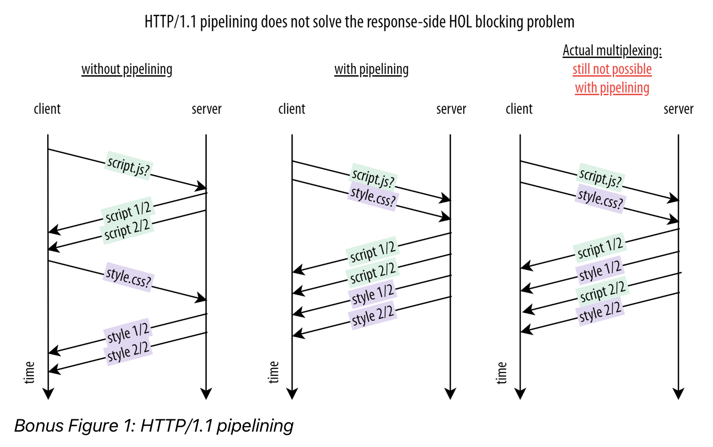

[toc]

### tcp三次握手、四次分手
三次握手：
```
客户端                 服务端
closed状态             listen状态
      sync包---------->
sync sent状态
      <------sync ack包 
                      sync receive状态
      sync ack包----->
established状态
                      established状态
```
四次挥手：
```
客户端                 服务端
established状态        established状态
      fin包----------->
fin-wait-1状态 
      <-------fin ack包
                      close-wait状态
fin-wait-2状态
      <-----------fin包
                      last-ack状态
time-wait状态 
      ------->fin ack包
                      closed状态
after 2MSL,
change to 
closed status
```
> fin-wait-1状态开始，客户端不会再继续发送业务数据给服务端了
> fin-wait-2状态和time-wait状态，客户端可能仍然会收到服务端发送来的业务数据
> last-ack状态开始，服务端不会再继续发送业务数据给客户端了

TIME_WAIT阶段的目的：
为了防止之前的连接的数据包在网络中滞留，并确保连接的可靠关闭。这样可以避免新的连接与之前的连接混淆。
网络中的数据包可能会经历延迟、重传或乱序等情况。即使对方发送了FIN包，但在网络中可能仍然存在该连接的数据包，这些数据包可能在TIME_WAIT状态期间到达。因此即使进入了TIME_WAIT状态，该方仍然会接收到对方发送的数据。

当网络中迟滞的数据全部接收到后，time-wait状态就结束了，怎么判断迟滞的数据全部接收到了呢？
1. 监听接收数据的事件或函数，在接收到数据时进行处理。
2. 使用定时器等机制，在一定时间内等待数据的到达，如果在超时时间内没有收到数据，则可以认为延迟的数据已经全部接收到。
  
> 需要注意的是，网络中的数据传输可靠的，可能会出现延迟、丢重传或乱序等情况。因此，**无法百分之百**确定延迟的数据是否全部接收到，只能按一定的机制来尽量保证数据的可靠性。

### https握手过程
首先完成tcp的三次握手；
接着：
1. 客户端发送请求给服务端，申请服务端证书；
2. 服务端将证书以明文的方式发送给客户端；
3. 客户端验证证书，从证书里提取服务端perm（公钥），客户端生成对称密钥，将对称密钥用服务端公钥加密，发送给服务端；
4. 服务端返回ack，告知客户端刚才的请求已经收到。

补充知识点：
1. 数字证书 
由权威机构颁发或者个人创建的证书，里面包含申请方的公钥、域名信息、hash算法、有效期、数字签名等等

2. 数字签名 
个人或者权威机构，对数字证书的内容，使用某种hash算法处理，得到散列值，然后用自己的私钥加密这个散列值，得到的数据，就是数字签名

3. 数字证书如何抵御中间人攻击
- 如果中间人篡改数字证书的信息，在浏览器使用内置的CA机构公钥解密数字签名后，会发现数字签名和证书正文信息不一致，从而发现中间人攻击风险；
  
- 如果中间人将数字证书调包成自己的数字证书，由于数字证书写着网站域名信息，浏览器就会发现证书和目标网站不一致，从而发现中间人攻击；

### http1.1 的队首阻塞
ref: 
- https://zhuanlan.zhihu.com/p/330300133#什么是队头阻塞（Head-Of-Line%20Blocking）？
- https://calendar.perfplanet.com/2020/head-of-line-blocking-in-quic-and-http-3-the-details/

http1.1，只允许上一个请求完整返回后，再去处理下一个请求。当上一个请求的返回值很大时，比如一个大型的文件，下一个请求就被阻塞住了，这就是队头阻塞。

**为什么上一个请求得到完整返回后，才能处理一个请求呢？**
这是因为相邻两个http返回值，在tcp层面，二者的数据可能混淆到一个tcp package里。tcp不知道哪些tcp package之间存在关系，只有遵守前后顺序，才能解决package间的关联问题。

如果不遵守顺序，浏览器无法分清楚上一个请求的返回值到哪个tcp package结束。

**http1.1支持多个并行的tcp连接，难道解决不了这个问题么？**
主流浏览器支持单个域名最多创建6个tcp连接。如果你请求的资源是6个，恰巧分配到6个tcp连接上，单独看一个tcp连接，它只会处理一个资源，不会有队头阻塞的问题。可实际上，你请求的资源不只6个，那么依然会出现单个tcp连接上，请求若干个资源的现象，这就又出现队头阻塞的问题。
另一方面，打开多个tcp连接，很增加操作系统压力。

### tcp的队头阻塞
应用层有队头阻塞问题，tcp层次也有。其原因在于，当tcp发送数据包1、2、3，对方接收到1、3，发现缺少数据包2，于是暂停将数据包3返回，这样数据包2就阻塞了数据包3。如果缺失数据包1，那么数据包2、3就会被阻塞。

不过这个队头阻塞和包的丢失率有关，一般情况下，包的丢失率非常小，因此tcp队头阻塞不是性能瓶颈。

但对于包丢失率较高的网络环境中，这就是瓶颈了，于是才迎来QUIC协议为代表的http3.0


### http2.0如何解决队首阻塞问题
数据帧。

在http1.1中，返回值是一个文本形式的报文，这个报文来到tcp层面，会被切割、分散到若干个更小的package里。

数据帧则是主动地将报文切割成更小的数据单元，即**数据帧**，而tcp层面，一个tcp package会包含一个或者若干个数据帧。

二者的区别在于，数据帧里包含顺序信息，数据帧可以乱序发送到另一端，另一端根据数据帧里的顺序信息，再将数据帧里的数据顺序整合。

发送http response的时候，直接按照数据帧发送，没有了报文的概念，这个数据帧可能是来自第一个请求的返回值，也可能是来自第二个请求的返回值。

### http2.0的多路复用和http1.1的pipeline有什么区别？


pipeline方式解决了请求的队头阻塞问题，但是没有解决响应的队头阻塞问题；

### QUIC不一定比TCP快的原因
- 要对QUIC package进行加密，而不是有效负载数据整体进行加密
- 多个流数据情形下，单个流数据依旧存在队头阻塞

QUIC提升速度的一些方法：
1. 增大QUICK package size, 比如 1460bytes
2. 用linux的GOS将多个udp package作为一个package处理
3. 减少ack package，比如每收到10个package，返回一个ack package，默认情况下，是收到2个package，返回一个ack package

### tcp连接中端口能不能重用
端口可以重用。默认情况下，TCP端口在被使用后会进入**TIME_WAIT**状态，这个状态会持续一段时间（通常是几分钟），在此期间该端口不能被其他进程或线程使用。这是为了确保之前的连接已经完全关闭，防止出现数据混乱或冲突的情况。

然而，有时候我们希望能够立即重用端口，而不必等待TIME_WAIT状态结束。这可以通过设置SO_REUSEADDR套接字选项来实现。当设置了SO_REUSEADDR选项后，即使端口处于TIME_WAIT状态，也可以立即重用该端口。

需要注意的是，使用SO_REUSEADDR选项时需要小心，因为如果两个连接使用相同的源IP、源端口、目标IP和目标端口，而且其中一个连接处于TIME_WAIT状态，那么**新连接可能会收到之前连接的残留数据**。因此SO_REUSEADDR选项时，需要确保不会出现这种情况，以避免数据混乱。

### http服务升级为websocket后，能不能继续提供服务
可以的。http服务升级为websocket，意味着某个应答socket自此接受websocket形式的报文。当向监听socket发送一个新的http请求时，监听socket会生成一个新的应答socket去处理。二者的应答，发生在不同的socket上，不会冲突。

### OSI模型中各层协议举例
* 应用层
  * http
  * ftp
  * nfs
  * smtp
* 传输层
  * tcp
  * udp
  * spx
* 网络层
  * ip
  * icmp
* 数据链路层
  * atm
  * fddi
* 物理层
  * rj45
  * 802.3
  * x.25


<br>

### 一台 24 口的交换机连接了 8 台设备，这里有多少个广播域？
1个广播域。
> 1. 冲突域是第一层物理层的概念，用第二层及其以上的设备才可以分离冲突域；  
> 2. 广播域是第二层数据链路层的概念，用第三层及其以上的设备才可以分离广播域;  
> 3. 交换机属于第二层的设备，所以可以分离冲突域，但不能分离广播域.
> 4. 一台交换机中的每个端口都是一个冲突域，而所有的端口构成一个广播域，有8台设备连接了交换机，则一共有8个冲突域，一个广播域。

<br>

### 在小红书公司的局域网中，署队长的私人电脑可以查看到的同事的电脑，也成功了登录了QQ，但无法访问到公司的站点"http://www.xiaohongshu.com”,请协助署队长查找最有可能出现的问题的地方是？
> UDP   
> DHCP  
> DNS  
> HTTP  
> 浏览器

解答：
* 可以访问QQ，说明UDP没问题；
* 可以看到同事的电脑，说明内网可以连上，DHCP没问题；
* 此时最有可能的就是DNS出现问题，无法解析到站点IP。
  
答案：`DNS`

<br>

### 网络拓扑结构中存在网桥S1、S2、S3、S4，若对应MAC地址分别为AABB-CCDD-EE00、AABB-CCDD-EE11、BBBB-CCDD-EE00、BBBB-CCDD-EE11,所有网桥优先级采用默认值,则使用STP协议后，哪个网桥会被确定为根网桥?
> S1   
> S2  
> S3  
> S4   

解答：
* 在一个广播域里找根网桥，在该广播域当中找网桥ID最小的交换机做根网桥。
* 优先级相同的情况下再去对比MAC地址，MAC地址最小的交换机做根网桥。
* 采取STP协议，在网桥优先级采用默认的情况下，网桥应该选择MAC地址较小的地址.

答案： `S1`